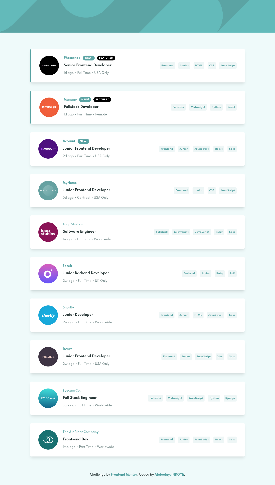

# Frontend Mentor - Job listings with filtering solution

This is a solution to the [Job listings with filtering challenge on Frontend Mentor](https://www.frontendmentor.io/challenges/job-listings-with-filtering-ivstIPCt). Frontend Mentor challenges help you improve your coding skills by building realistic projects. 

## Table of contents

- [Overview](#overview)
  - [The challenge](#the-challenge)
  - [Screenshot](#screenshot)
  - [Links](#links)
- [My process](#my-process)
  - [Built with](#built-with)
- [Author](#author)

## Overview

### The challenge

Users should be able to:

- View the optimal layout for the site depending on their device's screen size
- See hover states for all interactive elements on the page
- Filter job listings based on the categories

### Screenshot

### Links

- Solution URL: [https://github.com/NDOY3M4N/static-job-listings](https://github.com/NDOY3M4N/static-job-listings)
- Live Site URL: [https://ndoy3m4n.github.io/static-job-listings](https://ndoy3m4n.github.io/static-job-listings)

## My process

### Built with

- Semantic HTML5 markup
- Flexbox
- Mobile-first workflow
- [Vue](https://v3.vuejs.org/) - JS library
- [Vite](https://vitejs.dev) - Build Tool
- [Tailwind CSS](https://tailwindcss.com/) - THE CSS Framework

## Author

- Frontend Mentor - [@NDOY3M4N](https://www.frontendmentor.io/profile/NDOY3M4N)
- Twitter - [@NDOY3M4N](https://www.twitter.com/NDOY3M4N)
